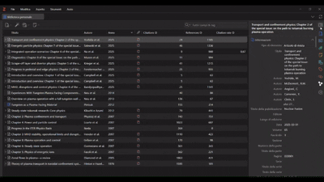

# Meristema

> **This is a fork.** Zotero Citation Map was originally created by
> [Alessandro Morandi (AlessMor)](https://github.com/AlessMor/zotero-citation-map).
> This repository is a modified version maintained by Daniel Nunes Locatelli,
> and it is diverging from upstream. It is not endorsed by the original author.
> See [NOTICE](NOTICE) for the full origin and modification statement.

Meristema is a plugin for Zotero 9 and 10 that brings citation networks,
bibliometric data, and paper discovery directly into your Zotero library.

A meristem is the tissue at a shoot or root tip where new growth originates.
That is what this plugin does with a library: seed a graph with a paper and it
grows outward, following references and citing works to the frontier of what
you already have.

The upstream project began as a weekend experiment: its author wanted to explore
the connections between a set of papers without moving repeatedly between Zotero
and external tools such as ResearchRabbit or Litmaps, and built a way to inspect
those relationships directly inside Zotero.

## Installation:

1. Open the last [release](https://github.com/daniel-locatelli/meristema-zotero/releases/latest) page.

2. Under **Assets**, download the latest `.xpi` file.

   > Do not download the automatically generated **Source code** `.zip` or `.tar.gz` archives.

3. in Zotero, open **Tools → Plugins**.

4. Drag the downloaded `.xpi` file into the Plugins window and confirm the installation when prompted.

5. Restart Zotero if required.

To **update** the plugin, install the newer `.xpi` in the same way. Zotero willreplace the existing version.

## Main Features

- **See how the papers in your library are connected**
  Build an interactive citation graph for a library, collection, or selected papers. Search and filter the graph, inspect a paper, and return directly to its Zotero item, notes, or PDF.
  

- **Explore outward from one or more papers**
  Add "seed" papers to a graph and it shows their references, citing papers, or both. Add a seed from the Seeds button, from a paper's detail pane, or by right-clicking its node; include papers outside Zotero, and choose the direction and scope behind the gear. Remove the last seed and the graph returns to your library.
  

- **Inspect citation data inside Zotero**
  Show citation and reference counts as library columns. Use the item pane to review overview metrics, references, and citing papers; search, sort, and filter long lists; refresh stale data and correct or add custom relationships.
  

- **Customize and export the map**
  Arrange papers by publication year, citation sequence, citation count, and other available metrics. Map values to axes, node size, and colour; filter by metadata and data quality; and export the visible graph as PNG, CSV, or JSON.

- **Discover and add missing papers**
  Explore external references, citing works, and similar papers alongside your Zotero items. Preview their metadata, open the DOI, mark incorrect matches, or add the paper directly to Zotero.

- **Work with multiple independent views**
  Open several Graph tabs at once. Rename views and use `Show in ›`, `New Graph from item` or `Add as seed to ›` to create a new view or add papers to an existing one. Each view keeps its own scope, seeds, filters, selection, and camera, and survives a refresh. Save a graph from the toolbar's Graph menu to come back to it later; a saved graph autosaves and reopens from the Graph menu or from Tools › Meristema › Open Saved Graph.

- **Control providers and updates**
  Choose which scholarly-data providers to use, which Zotero libraries shouldupdate automatically, and when cached data become stale. Refresh data manually when needed; long updates show progress and can be cancelled.
  

## Data sources

Citation and bibliographic data can be retrieved from:

- [Crossref](https://www.crossref.org/)
- [Semantic Scholar](https://www.semanticscholar.org/)
- [OpenCitations](https://opencitations.net/)
- [INSPIRE-HEP](https://inspirehep.net/)
- [OpenAlex](https://openalex.org/) (requires API key)

These services are independent of this project. Their terms, coverage, rate
limits, and data-quality limitations apply. Counts and relationship lists may
differ between providers. The plugin will try to integrate their data, preferring largest citation count.

## Acknowledgements:

This fork builds on [AlessMor/zotero-citation-map](https://github.com/AlessMor/zotero-citation-map)
by Alessandro Morandi, which is itself mainly inspired by other Zotero plugins:

- [windingwind/zotero-plugin-template](https://github.com/windingwind/zotero-plugin-template): initial template for the plugin.

- [zotero-cita/zotero-cita](https://github.com/zotero-cita/zotero-cita)

- [phdemotions/zotero-citegeist](https://github.com/phdemotions/zotero-citegeist)

- [eschnett/zotero-citationcounts](https://github.com/eschnett/zotero-citationcounts)

- [MuiseDestiny/zotero-style](https://github.com/MuiseDestiny/zotero-style)

- [danieleongari/zotero-openalex](https://github.com/danieleongari/zotero-openalex)

- [zotero-INSPIRE](https://github.com/fkguo/zotero-inspire)

The plugin was renamed from Zotero Citation Map to Meristema when this fork
diverged. See [NOTICE](NOTICE) for the full origin and modification statement.

## License

This program is free software, licensed under the
**GNU Affero General Public License, version 3 or later** (AGPL-3.0-or-later).
The full text is in [LICENSE](LICENSE); copyright and modification notices are
in [NOTICE](NOTICE).

It is distributed in the hope that it will be useful, but WITHOUT ANY WARRANTY;
without even the implied warranty of MERCHANTABILITY or FITNESS FOR A PARTICULAR
PURPOSE. See the license for details.
